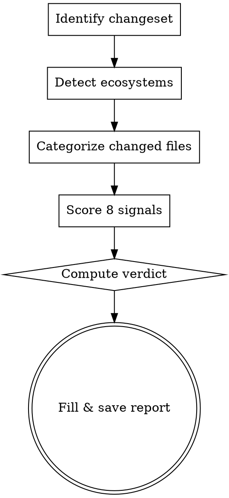

# Change Trajectory Assessment

Evaluate whether a proposed change improves or degrades the repository's quality trajectory. Produces a merge recommendation (RECOMMEND MERGE / MERGE WITH CONDITIONS / HOLD / BLOCK) based on eight quality signals.

**Announce at start:** "I'm using the change-trajectory skill to assess this change."

If a repo-assessment report exists in `reports/assessment/`, read the most recent one — it establishes baseline quality context for interpreting signals.

Assume you are the last stage of a PR review pipeline. Assume all checks pass, all tests pass, all audits pass, the build succeeds, and integrations pass. Your job is to assess the changes and establish whether or not they raise the overall quality of the repository or they compromise it.

---

## Flow



---

## Anti-Patterns

| Thought                              | Reality                                                                                                                                            |
| ------------------------------------ | -------------------------------------------------------------------------------------------------------------------------------------------------- |
| "Tool not available → NEUTRAL"       | Tool absence doesn't mean no problem. Investigate what commands exist for this ecosystem before giving up.                                         |
| "Tests pass → coverage is fine"      | Passing tests don't tell you if new code paths are covered. Read the diff — what logic was added, is there a test that would catch it being wrong? |
| "Line ratio is authoritative"        | Type declarations and constants don't need tests. Branching logic does. The ratio is a starting point, not a verdict.                              |
| "CI diff looks clean"                | Multi-line step removals span many diff lines, none starting with `run:`. Read the full workflow diff, not just grep output.                       |
| "Nothing flagged → security is fine" | Heuristic patterns catch common issues, not all issues. Review sensitive code paths manually when in doubt.                                        |

---

## Step 1 — Identify the Changeset

Determine what is being assessed. Accept any of these forms:

- PR URL or number → use `gh pr diff <number>` and `gh pr view <number>`
- Branch name → compare against the default branch
- Commit range → `git diff <base>..<tip>`
- No argument → compare HEAD against main/master

Find the merge base (where the branch diverged) and get the list of changed files. If the changeset is on the default branch itself (base equals HEAD), assess the most recent commit instead and note it.

```bash
DEFAULT_BRANCH=$(git remote show origin 2>/dev/null | grep "HEAD branch" | awk '{print $NF}')
[ -z "$DEFAULT_BRANCH" ] && DEFAULT_BRANCH=$(git branch -r | grep -E "origin/(main|master)" | head -1 | sed 's|.*origin/||' | xargs)
[ -z "$DEFAULT_BRANCH" ] && DEFAULT_BRANCH="main"
BASE=$(git merge-base HEAD $DEFAULT_BRANCH 2>/dev/null || echo "$DEFAULT_BRANCH")
git diff --name-only $BASE..HEAD
git diff --stat $BASE..HEAD | tail -3
```

Record the base ref and changeset description. For PRs, note the title and description — they provide intent context that informs proportionality judgments in Signal 2.

---

## Step 2 — Detect Ecosystems

Identify which ecosystems are present by looking for manifest files: `package.json` (Node.js), `pyproject.toml`/`requirements.txt` (Python), `go.mod` (Go), `Cargo.toml` (Rust). Record every detected ecosystem — it determines which tools to use in later steps.

---

## Step 3 — Categorize Changed Files

Classify the changed files into:

- **Source** — business logic (non-test code)
- **Tests** — test and spec files
- **CI/CD config** — workflow files, pipeline configs
- **Quality tool config** — linting, type checking, formatting configs
- **Dependency manifests** — lockfiles, requirements files
- **Documentation/other** — markdown, yaml, json, etc.

Record counts for each category. These inform proportionality judgments in Signal 2.

---

## Step 4 — Score Eight Quality Signals

Score each signal: **IMPROVING** (↑) / **NEUTRAL** (→) / **DEGRADING** (↓) / **CRITICAL** (✗)

- **IMPROVING**: The change leaves this dimension measurably better
- **NEUTRAL**: No material effect on this dimension
- **DEGRADING**: The change makes this dimension worse, but not catastrophically
- **CRITICAL**: The change breaks, removes, or severely weakens this dimension

### Signal 1: Test Suite Health

**What matters:** Did the change add new tests for new logic? Does the new logic appear correct?

Assess the delta this change introduces. Read the new logic in the diff for correctness errors: reversed conditions, off-by-one bounds, null dereferences on unchecked values, unhandled error returns, or logic inversions. Tests don't catch what they don't test — a passing suite doesn't mean correct logic.

| Score     | Criterion                                                                                                |
| --------- | -------------------------------------------------------------------------------------------------------- |
| IMPROVING | New tests were added; OR obvious pre-existing failures were fixed                                        |
| NEUTRAL   | No new code and no new tests; no signal to evaluate                                                      |
| DEGRADING | Tests modified in ways that reduce assertion strength (assertions commented out, failure cases removed); |
| CRITICAL  | Test files deleted with no equivalent replacement; OR tests bypassed                                     |

If no test suite exists: CRITICAL if new source files with branching logic were added, NEUTRAL if only config/docs/declarations changed.

### Signal 2: Coverage Alignment

**What matters:** Does new logic introduced by this change have corresponding tests? Are new code paths exercised?

Read the diff. Identify what new functions, methods, or conditional branches were added by this change. Ask: is there a test that would fail if this logic were wrong? Line counts are a calibration proxy — use them to start, then apply judgment.

Constants, type declarations, and configuration files do not need tests. Functions with conditional logic do. Do not penalize the change for pre-existing uncovered code — assess only the coverage ratio of what this change adds.

| Score     | Criterion                                                                                                                                                                                             |
| --------- | ----------------------------------------------------------------------------------------------------------------------------------------------------------------------------------------------------- |
| IMPROVING | Test lines added ≥ source lines added, OR new tests demonstrably cover new logic introduced by this change                                                                                            |
| NEUTRAL   | No new source code; OR new source is only constants/interfaces/type declarations with no branching logic; OR diff shows only parameter name changes, docstrings, or comments with no new control flow |
| DEGRADING | New functions/methods with branching logic added by this change, but no corresponding tests                                                                                                           |
| CRITICAL  | Test files deleted with no replacement; test assertions removed without equivalent coverage elsewhere                                                                                                 |

### Signal 3: Quality Infrastructure Integrity

**What matters:** Is the CI/CD pipeline being weakened? Are quality gates being relaxed?

Read the full workflow diff — not just grep output. A multi-line CI step that gets removed will show its content across many diff lines, none of which start with `run:`. Look for removed test runner invocations (`pytest`, `npm test`, `go test`, `cargo test`) and linter invocations (`eslint`, `ruff`, `golangci-lint`, `clippy`). Also check quality config files for rules being disabled or thresholds being lowered.

| Score     | Criterion                                                                                                                               |
| --------- | --------------------------------------------------------------------------------------------------------------------------------------- |
| IMPROVING | New quality gates added; linting rules strengthened; coverage thresholds raised; new security step added                                |
| NEUTRAL   | No changes to CI or quality configs                                                                                                     |
| DEGRADING | CI steps made optional via `continue-on-error: true`; linting rules relaxed or disabled                                                 |
| CRITICAL  | Test, lint, or security steps removed from CI; quality config deleted; `--no-verify` added to CI; coverage threshold lowered or removed |

### Signal 4: Static Analysis Compliance

**What matters:** Does this change worsen linter compliance? Are suppressions being added to silence violations rather than fix them?

Check the diff for inline suppression comments (`eslint-disable`, `# noqa`, `// nolint`, `#[allow(clippy`, `# type: ignore`). Net new suppressions indicate the author knew about violations and chose to silence them rather than fix them.

| Score     | Criterion                                                                                             |
| --------- | ----------------------------------------------------------------------------------------------------- |
| IMPROVING | Net reduction in lint violations; suppressions removed (removed > added)                              |
| NEUTRAL   | no new suppressions, new suppressions are valid and justified;                                        |
| DEGRADING | New inline suppressions added without justification; source files added outside of lint configuration |
| CRITICAL  | Linting config deleted or rules critically relaxed                                                    |

### Signal 5: Type Safety Trajectory

**What matters:** Is the change moving toward or away from type safety? Are type escapes being introduced?

Check the diff for type escapes (`: any`, `as any`, `@ts-ignore`, `@ts-nocheck`, `# type: ignore`, `cast(Any`). Run the type checker if available. Net new type escapes indicate the author encountered a type error and chose to suppress it rather than fix it.

| Score     | Criterion                                                                                                                   |
| --------- | --------------------------------------------------------------------------------------------------------------------------- |
| IMPROVING | Type escapes removed (removed > added); stricter type config enabled; new type annotations added to previously untyped code |
| NEUTRAL   | No change in type coverage;                                                                                                 |
| DEGRADING | New `any` types or `@ts-ignore` added (added > removed); Using `let _ = ...;` to bypass "must_use" directives               |
| CRITICAL  | Type checker fails after this change; type checking disabled in config (`strict: false` added); type config deleted         |

If TypeScript or mypy is not configured, score NEUTRAL and note the limitation.

### Signal 6: Dependency Posture

**What matters:** Do new dependencies introduce known vulnerabilities? Is the attack surface growing without justification?

If dependency manifests changed, read what was added or removed. Run a security audit for the affected ecosystem. If no audit tool is available, assess based on manifest inspection alone and note the limitation.

| Score     | Criterion                                                                                                                    |
| --------- | ---------------------------------------------------------------------------------------------------------------------------- |
| IMPROVING | Dependencies removed (reduced attack surface); known vulnerabilities patched via upgrade; lockfile freshened                 |
| NEUTRAL   | No dependency manifest changes                                                                                               |
| DEGRADING | New production dependencies added without clear justification; major version bumps without security motivation               |
| CRITICAL  | New production dependencies with known high/critical CVEs; lockfile deleted; manifest and lockfile diverge after this change |

### Signal 7: Security Posture

**What matters:** Does the change introduce security anti-patterns — hardcoded secrets, unsafe execution, auth bypasses?

Scan the diff for hardcoded credentials, dangerous execution patterns (`eval`, `exec`, `shell=True` on external input, `os.system`), and auth bypass flags. Check for changes to security scanner configs that weaken coverage. Heuristic patterns catch common issues — review sensitive code paths manually when in doubt.

| Score     | Criterion                                                                                                                                                                               |
| --------- | --------------------------------------------------------------------------------------------------------------------------------------------------------------------------------------- |
| IMPROVING | Security hardening added (input validation, auth checks, output encoding); known-vulnerable dependency removed; security scanner added                                                  |
| NEUTRAL   | No security-relevant changes detected                                                                                                                                                   |
| DEGRADING | Security config suppressions added; security-sensitive code paths modified without clear rationale in PR description                                                                    |
| CRITICAL  | Credentials or secrets visible in the diff; known dangerous patterns added (unsanitized `eval`, shell execution on external input, auth bypass flags); security scanner removed from CI |

### Signal 8: Intent Alignment

**What matters:** Does the code actually match what the PR claims to do? A change that does undisclosed work — or fails to do what it claims — is a quality failure independent of test coverage or linting.

Read the PR title and description (if available). Identify the stated purpose: what problem is being solved, what behavior is being changed, what the author says is in scope. Then read the diff and ask two questions:

1. Does the diff accomplish what the description claims?
2. Does the diff contain work that falls outside the stated scope?

A PR that claims to "fix a display bug" but modifies auth middleware is doing undisclosed work. A PR that claims to "add retry logic" but the diff contains no retry mechanism is failing to deliver. Both are alignment failures.

If no PR description is available, score NEUTRAL and note the absence.

| Score     | Criterion                                                                                                                                                                                                           |
| --------- | ------------------------------------------------------------------------------------------------------------------------------------------------------------------------------------------------------------------- |
| IMPROVING | Diff precisely matches the stated purpose; no out-of-scope changes; implementation is complete relative to the stated goal                                                                                          |
| NEUTRAL   | No PR description available; OR description is vague but diff is coherent and scoped; OR minor adjacent fixes clearly related to the stated work                                                                    |
| DEGRADING | Diff includes out-of-scope changes not mentioned in the description; OR implementation is partial relative to the stated goal (feature half-done)                                                                   |
| CRITICAL  | Stated problem and actual diff are unrelated; OR PR description fabricates behavior the diff does not implement; OR scope is so broad relative to the stated purpose that the true nature of the change is obscured |

---

## Step 5 — Compute Verdict

**Before applying rules, apply two adjustments:**

_Confidence adjustment:_ When a signal was scored due to absence of information (e.g. no PR description, missing tools), its confidence is LOW. A LOW-confidence DEGRADING counts as NEUTRAL for verdict purposes — note it in the Conditions section as "unverified." A LOW-confidence CRITICAL counts as DEGRADING. A low confidence IMPROVING counts as NEUTRAL.

_Scope proportionality check:_ If the diff touches a large number of files (rough heuristic: >20 files) but the stated PR purpose is narrow or small in scope, flag a scope disproportion. This does not automatically change any signal score, but it should be called out in the verdict paragraph and may contribute to a HOLD if the discrepancy is significant.

Apply in order (first matching rule wins):

1. **BLOCK** — if ANY signal is CRITICAL (after confidence adjustment)
2. **HOLD** — if 2 or more signals are DEGRADING (after confidence adjustment); OR if scope disproportion is significant; state the specific reasons that require human review; state the actions the submitter can take to improve the state of these changes.
3. **MERGE WITH CONDITIONS** — if exactly 1 signal is DEGRADING; state the specific condition inline
4. **RECOMMEND MERGE** — if all signals are NEUTRAL or IMPROVING

---

## Step 6 — Fill Report Template

```
# Change Trajectory Assessment: [CHANGESET]

Date: [DATE]
Changeset: [branch/PR/commit range — e.g., feat/my-feature vs main, PR #42]
Ecosystems detected: [LIST]
Files changed: [N source, M test, K CI/quality-config, J dependency, L other]
Base repo-assessment: [path to most recent report, or "none found"]

## Quality Signal Summary

Legend: ↑ = IMPROVING  → = NEUTRAL  ↓ = DEGRADING  ✗ = CRITICAL  |  Confidence: H = HIGH  M = MEDIUM  L = LOW (tool unavailable or signal ambiguous)

| # | Signal | Direction | Confidence | Evidence | Notes |
|---|---|---|---|---|---|
| 1 | Test Suite Health | [↑/→/↓/✗] | [H/M/L] | [command output summary] | [one line] |
| 2 | Coverage Alignment | [↑/→/↓/✗] | [H/M/L] | [source lines added: N, test lines added: M] | [one line] |
| 3 | Quality Infrastructure | [↑/→/↓/✗] | [H/M/L] | [files changed or "no CI/config changes"] | [one line] |
| 4 | Static Analysis | [↑/→/↓/✗] | [H/M/L] | [linter output summary] | [one line] |
| 5 | Type Safety | [↑/→/↓/✗] | [H/M/L] | [type checker output or escape counts] | [one line] |
| 6 | Dependency Posture | [↑/→/↓/✗] | [H/M/L] | [deps added/removed/audited] | [one line] |
| 7 | Security Posture | [↑/→/↓/✗] | [H/M/L] | [patterns found or "none detected"] | [one line] |
| 8 | Intent Alignment | [↑/→/↓/✗] | [H/M/L] | [PR description vs diff scope summary] | [one line] |

## Critical Findings

[List each CRITICAL signal with specific evidence. If none: "No critical findings."]

## Necessity Rationale

[Answer two questions explicitly:
1. What specific problem does this change solve? (Quote or paraphrase the PR description's problem statement.)
2. Is there evidence in the codebase that this problem actually exists? (Call sites, error reports, failing behavior, referenced issue numbers, comments in the code.)

If evidence of necessity is absent or thin, say so directly. A change that solves a problem nobody has costs more than it adds regardless of quality signal scores.]

## Conditions Required for Merge

[For MERGE WITH CONDITIONS: state the exact change needed before merging.
For HOLD: list each DEGRADING signal and what's needed to bring it to NEUTRAL or IMPROVING.
For BLOCK: list each CRITICAL signal and what's needed to resolve it before re-evaluation.
For RECOMMEND MERGE: write "N/A"]

## Verdict

**[RECOMMEND MERGE / MERGE WITH CONDITIONS / HOLD / BLOCK]**

[One paragraph: what does this change do to the project's quality trajectory? Name the strongest positive and negative signals. Reference engineering principles (test coverage, type safety, security posture) where relevant. Be specific about what the change accomplishes and what it costs.]
```

---

## Step 7 — Save the Report

```bash
PROJECT=$(git remote get-url origin 2>/dev/null | sed 's|.*/||; s|\.git$||')
[ -z "$PROJECT" ] && PROJECT=$(basename "$(pwd)")
DATE=$(date +%Y-%m-%d)
CHANGESET=$(git rev-parse --abbrev-ref HEAD 2>/dev/null | sed 's|/|-|g' || echo "unknown")
mkdir -p reports/change-trajectory
REPORT_PATH="reports/change-trajectory/${DATE}-${PROJECT}-${CHANGESET}.md"
```

Write the filled report template to `$REPORT_PATH`. Output: `Report saved to $REPORT_PATH`

---

## Step 8 - Output the Report

Display the report to the user as output.
