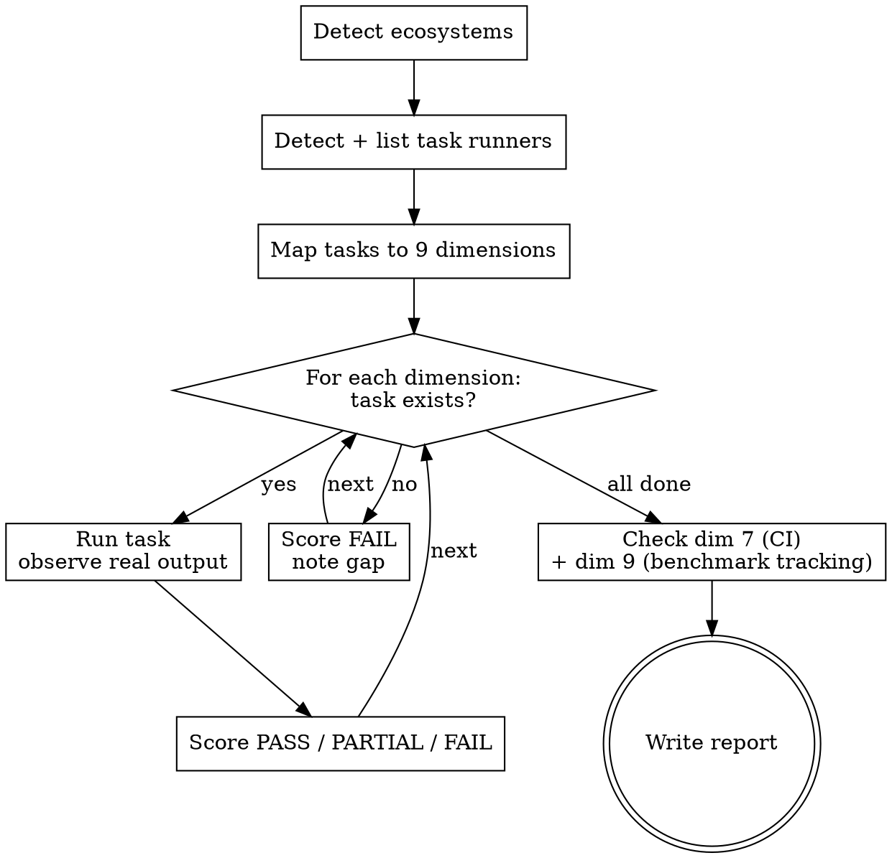

# Repository Assessment

Score a repository across nine quality dimensions. Produce a report suitable for driving remediation via the `repo-hardening` skill.

**This skill is read-only.** Do not add tasks, install tools, or modify the repository. If gaps need fixing, use `repo-hardening` after this assessment.

<HARD-GATE>
Do NOT write the report until you have run each existing task and observed real output. Assessment from code inspection alone is not assessment — it is guessing.
</HARD-GATE>

## Anti-Patterns

**"I can tell from the config files."** Run the tasks. A linter config that fails to run scores differently than one that passes.

**"There's no test suite."** Score dimension 1 FAIL. Do not write smoke tests — that is repo-hardening's job.

**"I'll skip dimensions with no task."** FAIL is still a score. Record it.

## Checklist

1. **Detect ecosystems** — identify all language ecosystems present
2. **Detect task runners** — find Justfile, Makefile, Taskfile.yml, npm scripts, mise
3. **List all tasks** — run the task runner's list command
4. **Map tasks to nine dimensions** — note which dimensions have no task (= FAIL)
5. **Run each task** — observe real output; score PASS / PARTIAL / FAIL
6. **Score CI/CD and benchmark tracking** — check with detection commands below
7. **Write the report**

## Flow



## Detection Commands

Run from the repository root:

```bash
# Ecosystems
find . -maxdepth 3 \( -name "package.json" -o -name "yarn.lock" -o -name "pnpm-lock.yaml" \
  -o -name "requirements.txt" -o -name "pyproject.toml" -o -name "setup.py" \
  -o -name "Pipfile" -o -name "uv.lock" -o -name "go.mod" -o -name "Cargo.toml" \
  -o -name "*.csproj" -o -name "*.sln" \
\) -not -path "*/node_modules/*" -not -path "*/target/*" -not -path "*/.git/*" 2>/dev/null | sort

# Task runners
ls Justfile Makefile Taskfile.yml Taskfile.yaml .mise.toml package.json 2>/dev/null

# CI workflows + key steps
find . -maxdepth 4 \( -path "*/.github/workflows/*.yml" -o -path "*/.github/workflows/*.yaml" \) \
  -not -path "*/.git/*" 2>/dev/null | sort
grep -h "^\s*\(name:\|run:\|uses:\)" .github/workflows/*.yml 2>/dev/null | head -40

# Benchmark tracking
git branch -a 2>/dev/null | grep -E "etc/bench|\.metadata" | head -5
grep -r "etc/bench\|bench.*artifact\|store.*bench\|benchmark.*history" .github/ 2>/dev/null | head -10

# Coverage artifacts (run after scoring dimension 8)
find . -maxdepth 4 \( -name "lcov.info" -o -name "coverage.xml" -o -name "coverage.json" \
  -o -path "*/coverage/*" \) -not -path "*/node_modules/*" -not -path "*/.git/*" 2>/dev/null | sort
```

## Nine Dimensions

| #   | Dimension          | Common task names                        | Scoring                                                                                              |
| --- | ------------------ | ---------------------------------------- | ---------------------------------------------------------------------------------------------------- |
| 1   | Unit Tests         | `test`, `unit`, `spec`                   | PASS: exits 0, meaningful output; PARTIAL: tool not installed; FAIL: no task                         |
| 2   | Integration Tests  | `test:integration`, `e2e`, `integration` | PASS: exits 0; PARTIAL: tool not installed; FAIL: no task                                            |
| 3   | Benchmarks         | `bench`, `benchmark`, `perf`             | PASS: exits 0; PARTIAL: tool not installed; FAIL: no task                                            |
| 4   | Static Analysis    | `lint`, `check`, `fmt:check`             | PASS: exits 0; PARTIAL: config errors; FAIL: no task                                                 |
| 5   | Type Checking      | `typecheck`, `type-check`, `types`       | PASS: exits 0; PARTIAL: tool not installed; FAIL: no task                                            |
| 6   | Security Scanning  | `audit`, `security`, `vuln`, `scan`      | PASS: exits 0 with high-vuln enforcement; PARTIAL: runs without enforcement; FAIL: no task           |
| 7   | CI/CD Pipeline     | — (detection commands)                   | PASS: CI exists + test + lint steps; PARTIAL: CI exists, build only; FAIL: no CI                     |
| 8   | Coverage Tracking  | `coverage`, `cov`                        | PASS: exits 0 + artifact in `coverage/`; PARTIAL: exits 0, no artifact; FAIL: no task                |
| 9   | Benchmark Tracking | — (detection commands)                   | PASS: CI runs benchmarks + stores results persistently; PARTIAL: runs, results discarded; FAIL: none |

After scoring dimension 8, run the coverage artifacts detection command. No file = PARTIAL regardless of exit code.

## Verdict

**SUITABLE** for automated auditing requires ALL of:

- Dimension 1 (Unit Tests): PASS
- Dimension 4 (Static Analysis): PASS
- Dimension 6 (Security Scanning): PASS or PARTIAL
- Dimension 7 (CI/CD Pipeline): PASS
- No more than 1 other dimension scored FAIL

Otherwise: **NOT SUITABLE** — state which conditions are not met.

## Report

Fill the template in `reference/report-template.md` and save:

```bash
PROJECT=$(git remote get-url origin 2>/dev/null | sed 's|.*/||; s|\.git$||')
[ -z "$PROJECT" ] && PROJECT=$(basename "$(pwd)")
DATE=$(date +%Y-%m-%d)
mkdir -p reports/assessment
# Save to: reports/assessment/${DATE}-${PROJECT}-analysis.md
```

## Terminal State

Report written to `reports/assessment/`. Repository is unchanged. If the verdict is NOT SUITABLE or any gaps exist, offer to run `repo-hardening`.
