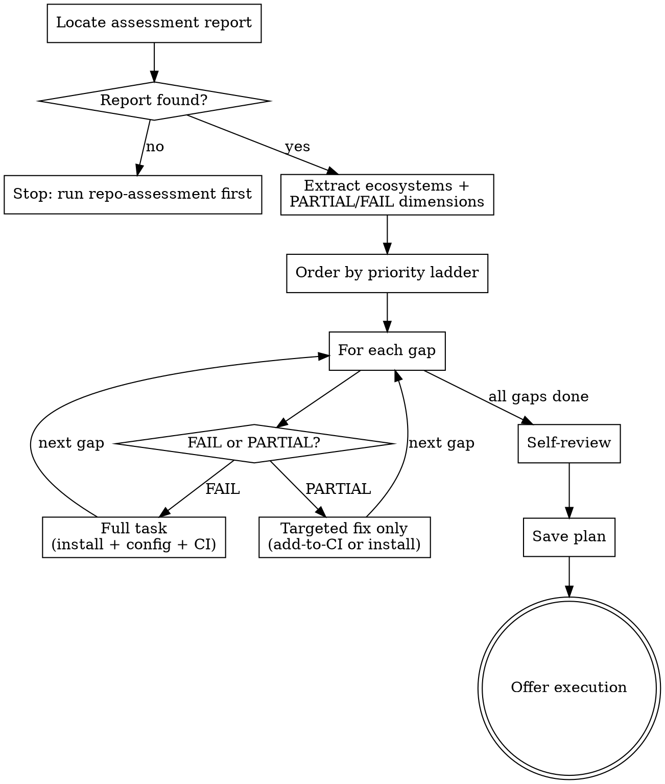

# Repository Hardening Plan

Transform a repo-assessment report into an executable implementation plan. Each gap becomes a concrete, ordered task. The output plan is compatible with `superpowers:executing-plans` and `superpowers:subagent-driven-development`.

<HARD-GATE>
Do NOT begin generating tasks until the assessment report is open and all PARTIAL/FAIL dimensions are listed. Do not generate tasks for dimensions that scored PASS.
</HARD-GATE>

## Anti-Patterns

**"I'll add a CI step for this dimension even though it scored PASS."** Don't. PASS means it's already working.

**"I can guess the ecosystem from the task names."** Don't. Read the Ecosystems field from the report header — it's explicit.

**"I'll leave `<your-package-name>` as a placeholder."** Don't. Read the source tree and use a real module name, or write an explicit substitution instruction the implementer cannot miss.

**"I'll generate a full task when the dimension was PARTIAL."** Don't. PARTIAL means the tool exists — generate only the targeted fix (usually: add to CI, or install missing tool).

## Checklist

1. **Locate the assessment report** — `reports/assessment/` or in current conversation
2. **Extract from the report** — ecosystems, and every dimension row scored PARTIAL or FAIL
3. **Order gaps by priority ladder** — CI/CD first, unit tests second, see Step 2
4. **Generate one task per gap** — FAIL → full task; PARTIAL → targeted fix only
5. **Self-review** — gap coverage, ecosystem specificity, dependency order, no placeholders
6. **Save plan and offer execution**

## Flow



---

## Step 1 — Locate the Assessment Report

```bash
ls reports/assessment/*.md 2>/dev/null | sort -r | head -5
find . -maxdepth 5 -name "*.md" | xargs grep -l "Quality Infrastructure Summary" 2>/dev/null | head -5
```

If no report file is found, look for assessment output in the current conversation. If none exists: "No repo-assessment report found. Run the `repo-assessment` skill first, then share or save the report before using this skill."

Extract from the report:

- Detected ecosystems (line beginning with "Ecosystems:")
- Each dimension row: `| # | Dimension | Status | Task | Evidence |`

Dimensions scored PASS or N/A are excluded from the plan.

---

## Step 2 — Build the Remediation Queue

Order gaps by this priority ladder. FAIL at a given priority outranks PARTIAL at the same level.

| Priority | Dimension              | Why this order                                            |
| -------- | ---------------------- | --------------------------------------------------------- |
| 1        | 7 — CI/CD Pipeline     | All other gates are useless without automated enforcement |
| 2        | 1 — Unit Tests         | The baseline signal for everything else                   |
| 3        | 4 — Static Analysis    | Cheapest class of bug prevention                          |
| 4        | 6 — Security Scanning  | Blocking for automated auditing                           |
| 5        | 5 — Type Checking      | Prevents silent contract violations                       |
| 6        | 2 — Integration Tests  | Validates cross-component behavior                        |
| 7        | 8 — Coverage Tracking  | Requires tests to be meaningful                           |
| 8        | 3 — Benchmarks         | Requires working code                                     |
| 9        | 9 — Benchmark Tracking | Requires benchmarks to exist                              |

**Dependencies:** Coverage Tracking requires Unit Tests. Benchmark Tracking requires Benchmarks. If both ends of a dependency pair need work, merge them into a single task.

---

## Step 3 — Write the Plan Document

```bash
PROJECT=$(git remote get-url origin 2>/dev/null | sed 's|.*/||; s|\.git$||')
[ -z "$PROJECT" ] && PROJECT=$(basename "$(pwd)")
DATE=$(date +%Y-%m-%d)
mkdir -p docs/plans/hardening
PLAN_PATH="docs/plans/hardening/${DATE}-${PROJECT}-hardening.md"
```

**Plan header:**

```markdown
# Repository Hardening Implementation Plan

> **For agentic workers:** REQUIRED SUB-SKILL: Use superpowers:subagent-driven-development (recommended) or superpowers:executing-plans to implement this plan task-by-task. Steps use checkbox (`- [ ]`) syntax for tracking.

**Goal:** Bring [REPO NAME]'s quality infrastructure to a level suitable for automated auditing without human review.

**Ecosystems:** [LIST FROM REPORT]

**Gaps addressed (in order):** [e.g., CI/CD Pipeline (FAIL), Unit Tests (FAIL), Static Analysis (PARTIAL)]

**Assessment report:** [file path, or "provided in conversation"]

---
```

Then generate one task per gap. Only include tasks for PARTIAL or FAIL dimensions. Use ecosystem-appropriate commands throughout — no generic placeholders.

---

## Task Quality Bars

Each task type has a minimum bar. FAIL → full task meeting the bar. PARTIAL → only the missing piece.

**CI/CD Pipeline (FAIL):** A working `.github/workflows/ci.yml` that runs on push/PR, installs dependencies, and executes tests. All other quality gates added in this plan must also be wired into CI as steps are completed.

**CI/CD Pipeline (PARTIAL):** Add the specific missing quality gate steps to the existing workflow — do not rewrite the whole file.

**Unit Tests (FAIL):** Install the ecosystem's standard test runner, write one smoke test that verifies the runner is wired up, confirm it passes locally. Add a `test` step to CI.

**Static Analysis (FAIL):** Install the ecosystem's standard linter, create a minimal config, run it clean against the existing codebase (fix or suppress any errors), add a lint step to CI. PARTIAL: add to CI only.

**Security Scanning (FAIL):** Install the ecosystem's standard vulnerability scanner, run a baseline scan and address any high-severity findings, add a scan step to CI. PARTIAL: add to CI only.

**Type Checking (FAIL):** For statically-typed ecosystems (Go, Rust), this is already enforced by the compiler — skip this task. For Python, install mypy and run it clean. For Node.js, only add TypeScript checking if the project already uses TypeScript — do not introduce TypeScript to a JS project. Add a type-check step to CI.

**Integration Tests (FAIL):** Create a separate integration test directory, write one test that crosses a real boundary (file I/O, subprocess, network, or end-to-end public API invocation). A test that just returns `true` does not qualify. Add to CI, ideally as a separate job. PARTIAL: create the separate directory structure if tests are currently mixed with unit tests.

**Coverage Tracking (FAIL):** Run tests with coverage measurement, create an orphan `etc/coverage` branch to store history, add CI steps to measure and commit coverage reports to that branch after each run. PARTIAL: add the persistence step if coverage is measured but not stored. Use the patterns in `reference/metadata-branch-template.md` to set up the CI step that commits to the orphan branch.

**Benchmarks (FAIL):** Only generate this task if the project has performance-sensitive code. CLI tools, config libraries, and similar projects do not need benchmarks — note this and skip. If applicable: install the benchmark library, write one benchmark for the hottest path (read the source first), run it and capture baseline output, commit the result.

**Benchmark Tracking (FAIL/PARTIAL):** Create an orphan `etc/benchmarks` branch, add CI steps to run benchmarks and commit output to that branch. Mirrors the coverage tracking pattern. Use the patterns in `reference/metadata-branch-template.md` to set up the CI step that commits to the orphan branch.

---

## Step 4 — Closing Section

Add to the end of the plan:

```markdown
---

## Verification

After all tasks complete, run the repo-assessment skill again to confirm all targeted dimensions now score PASS.

Expected re-assessment result:

- All dimensions that were PARTIAL or FAIL should now be PASS
- Verdict should change from NOT SUITABLE to SUITABLE (if all blocking gaps were addressed)
```

---

## Step 5 — Self-Review Before Saving

1. **Gap coverage:** Is there a task for every PARTIAL/FAIL dimension? List any missed.
2. **Ecosystem specificity:** Every command matches the detected ecosystem — no generic placeholders.
3. **Dependency order:** Coverage Tracking appears after Unit Tests. Benchmark Tracking appears after Benchmarks.
4. **No placeholders:** No "TBD", "TODO", "your package name", or "implement as needed" left unresolved.

Fix inline before saving.

---

## Step 6 — Save and Offer Execution

Save the completed plan to `$PLAN_PATH`.

Then offer:

> "Plan complete and saved to `docs/plans/hardening/<filename>.md`. Two execution options:
>
> **1. Subagent-Driven (recommended)** — fresh subagent per task, review between tasks. Use `superpowers:subagent-driven-development`.
>
> **2. Inline Execution** — execute tasks in this session with checkpoints. Use `superpowers:executing-plans`.
>
> Which approach?"
